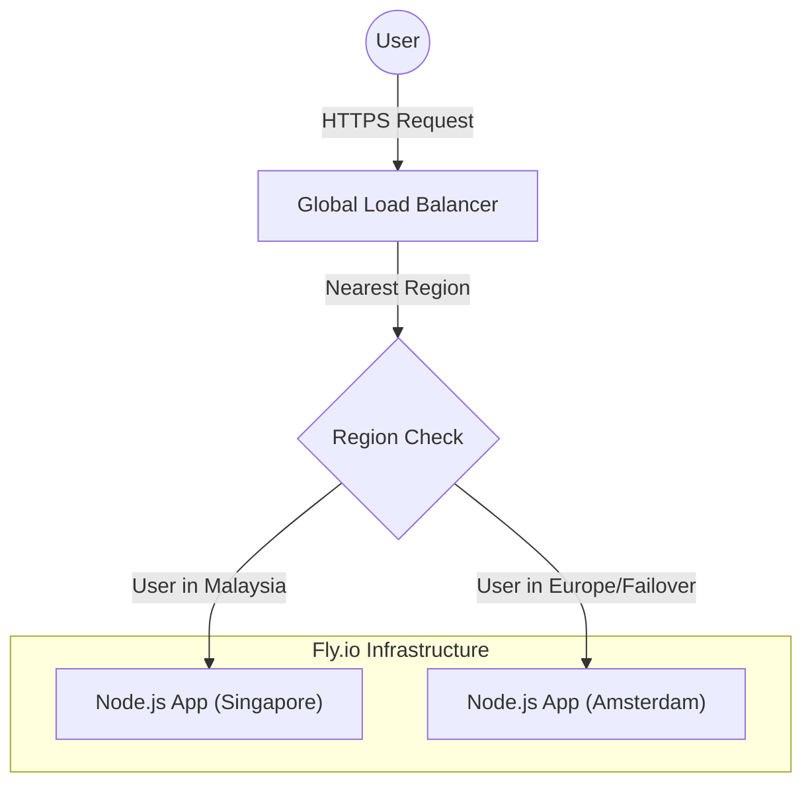

# 🚗 Wahdah Geo-Distributed Fleet API

  

## 📖 About The Project

This is a **Proof of Concept (PoC)** for a High-Availability (HA) Fleet Management API designed with **Zero Downtime** principles.

The goal of this project is to demonstrate how a car rental platform (like Wahdah) can handle traffic spikes and server failures by leveraging **Edge Computing**. The application is deployed across two continents:
1.  **Singapore (`sin`)**: Primary region for low-latency access in Malaysia/SE Asia.
2.  **Amsterdam (`ams`)**: Failover region to ensure service continuity if the Asian region goes down.

## 🏗 Architecture

The system uses **Fly.io's Anycast IP** routing. Users are automatically routed to the nearest healthy server.



## 🚀 Key Features (DevOps Highlights)
1.  **🌐 Multi-Region Deployment:** Hosted in sin (Asia) and ams (Europe) simultaneously.
2.  **🛡️ High Availability & Failover:** If the Singapore server is stopped/crashes, traffic is automatically rerouted to Amsterdam without user error (404/500).
3.  **🤖 CI/CD Automation:** Fully automated deployment pipeline using GitHub Actions. Code pushed to the main branch is automatically built and deployed to production.
4.  **🐳 Dockerized:** Built on node:18-alpine for a lightweight, secure, and fast-booting container image.
5.  **💰 Cost Optimization:** Infrastructure scaled to use minimal resources (Shared CPU-1x) to prevent over-provisioning.

## 🛠 Tech Stack
1.  **Runtime:** Node.js & Express
2.  **Containerization:** Docker
3.  **Orchestration/Cloud:** Fly.io (Firecracker MicroVMs)
4.  **CI/CD:** GitHub Actions
5.  **Language:** JavaScript

## ⚙️ How It Works
**1. Global Routing**\
The API returns a JSON response indicating which server handled the request.

```JSON
{
  "message": "Wahdah Fleet System Operational",
  "region": "sin",
  "timestamp": "2023-10-27T10:00:00.000Z"
}
```

If you access from Malaysia, you see ```"region": "sin"```.\
If you simulate a VPN from Europe (or if sin is down), you see ```"region": "ams"```.

**2. Automated Deployment**\
The .github/workflows/fly.yml file handles the pipeline:
   1. Check out code.
   2. Setup ```flyctl```.
   3. Deploy directly to Fly.io Machines using ```FLY_API_TOKEN```.

## 💻 Local Development
To run this locally on your machine:

**1. Clone the repo**

```Bash
git clone https://github.com/Aiman-Nizam/wahdah-fleet-api.git
cd wahdah-fleet-api
```

**2. Install Dependencies**

```Bash
npm install
```

**3. Run with Docker**

```Bash
docker build -t wahdah-fleet .
docker run -p 3000:3000 wahdah-fleet
```

## 📝 Future Improvements
1. Implement **Postgres Read Replicas** (**Write** in SIN, **Read** in AMS).
2. Add **Health Checks** for proactive monitoring.
3. Integrate **Prometheus/Grafana** for real-time latency dashboards.

_Developed by Aiman for Wahdah Technologies Interview._
